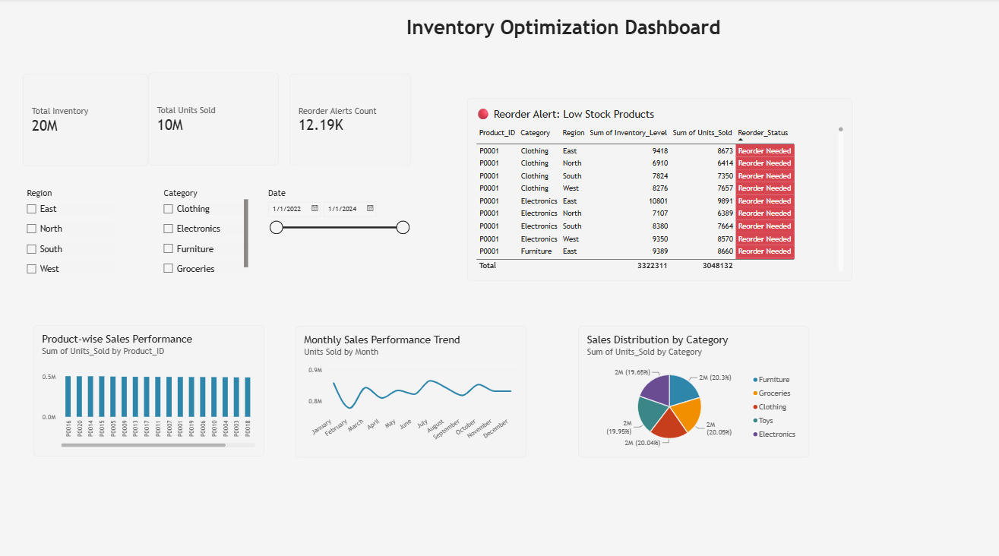

# 📦 Inventory Optimization Dashboard

An end-to-end data analytics project that combines **SQL, Python, and Power BI** 
to help retail businesses identify stock risks, understand sales performance, 
and make data-driven reordering decisions.

## 🎯 Business Problem

Retail businesses often struggle with two costly inventory mistakes:
- **Overstocking** — tying up capital and warehouse space in slow-moving products
- **Understocking** — losing sales due to stockouts on high-demand products

This project analyzes 2 years of retail transaction data (73,100+ records across 
5 stores, 20 products, 4 regions) to flag which products need immediate reordering, 
identify fast vs. slow-moving inventory, and reveal sales trends across categories 
and regions.

## 🛠️ Tools & Tech Stack

- **SQL (SQLite)** — Data querying and aggregation
- **Python (Pandas, NumPy, Matplotlib, Seaborn)** — Data cleaning, business logic, 
  and visualization
- **Power BI** — Interactive dashboard for stakeholders

## 🔍 Project Workflow

1. **Data Loading** — Raw CSV loaded and converted into a SQLite database
2. **SQL Analysis** — Queries written to extract category-wise sales, regional 
   performance, and stock buffer metrics
3. **Python Analysis** — 
   - Data cleaning and validation
   - Custom **Reorder Logic**: flags any product where inventory level is within 
     20% of recent units sold as "Reorder Needed"
   - Visualizations for reorder distribution and category breakdown
4. **Power BI Dashboard** — Interactive dashboard with KPIs, slicers, and 
   conditional formatting for at-a-glance decision-making

## 📊 Dashboard Preview

## 💡 Key Insights

1. **Inventory Overview:** The business maintains a total inventory of 20M units 
   against 10M units sold — a 2:1 inventory-to-sales ratio overall, though this 
   masks significant variation at the individual product level.

2. **Reorder Risk:** 12.19K records were flagged as "Reorder Needed" — 
   product-region combinations where inventory is dangerously close to recent 
   sales volume, requiring immediate restocking attention.

3. **Category Performance:** Sales are almost evenly split across all five 
   categories (~19–20% each), meaning no single category dominates demand. 
   Inventory strategy should be applied consistently rather than favoring one 
   category.

4. **Sales Trend:** Monthly sales fluctuate between ~0.8M and 0.9M units, with 
   visible dips and peaks throughout the year — indicating demand is not flat 
   and reorder planning should account for these cyclical shifts.

## 📁 Files in This Repository

| File | Description |
|------|-------------|
| `inventory_analysis.py` | Full Python script: SQL queries, data cleaning, reorder logic, visualizations |
| `cleaned_inventory_data.csv` | Final cleaned dataset with the added Reorder_Status column |
| `dashboard_screenshot.png` | Screenshot of the final Power BI dashboard |

## 🚀 Business Impact

This dashboard enables inventory managers to move from reactive stock-checking 
to a **proactive, data-driven reordering system** — reducing the risk of 
stockouts while avoiding unnecessary overstocking, ultimately improving both 
customer satisfaction and capital efficiency.

---
*Dataset: Retail Store Inventory data (2022–2024), sourced from Kaggle.*
